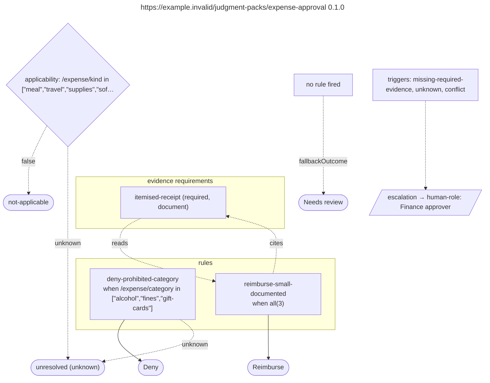

# expense-approval — pack diagram

**Zoomable viewer:** http://localhost:8002/enterprise-demo/diagrams/expense-approval.html (layer toggles, zoom, pan)

```mermaid
---
title: "https://example.invalid/judgment-packs/expense-approval 0.1.0"
---
flowchart TD
  applicability{"applicability: /expense/kind in [#quot;meal#quot;,#quot;travel#quot;,#quot;supplies#quot;,#quot;sof…"}
  applicability -. "false" .-> not_applicable
  applicability -. "unknown" .-> unresolved_unknown
  subgraph evidence["evidence requirements"]
    ev_itemised_receipt["itemised-receipt (required, document)"]
  end
  subgraph rules
    rule_deny_prohibited_category["deny-prohibited-category<br/>when /expense/category in [#quot;alcohol#quot;,#quot;fines#quot;,#quot;gift-cards#quot;]"]
    rule_reimburse_small_documented["reimburse-small-documented<br/>when all(3)"]
  end
  rule_deny_prohibited_category --> out_deny
  rule_deny_prohibited_category -. "unknown" .-> unresolved_unknown
  rule_reimburse_small_documented --> out_reimburse
  ev_itemised_receipt -. "reads" .-> rule_reimburse_small_documented
  rule_reimburse_small_documented -. "cites" .-> ev_itemised_receipt
  out_reimburse(["Reimburse"])
  out_deny(["Deny"])
  out_review(["Needs review"])
  no_rule_fired["no rule fired"]
  no_rule_fired -. "fallbackOutcome" .-> out_review
  unresolved_unknown(["unresolved (unknown)"])
  not_applicable(["not-applicable"])
  escalation[/"escalation → human-role: Finance approver"/]
  escalation_triggers["triggers: missing-required-evidence, unknown, conflict"]
  escalation_triggers -.-> escalation
  applicability ~~~ evidence
  evidence ~~~ rules
```
