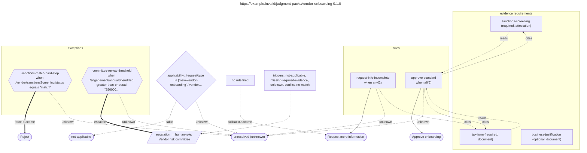

# Vendor onboarding — pack diagram

```mermaid
---
title: "https://example.invalid/judgment-packs/vendor-onboarding 0.1.0"
---
flowchart TD
  applicability{"applicability: /request/type in [#quot;new-vendor-onboarding#quot;,#quot;vendor…"}
  not_applicable(["not-applicable"])
  applicability -. "false" .-> not_applicable
  applicability -. "unknown" .-> unresolved_unknown
  subgraph evidence["evidence requirements"]
    ev_sanctions_screening["sanctions-screening (required, attestation)"]
    ev_tax_form["tax-form (required, document)"]
    ev_business_justification["business-justification (optional, document)"]
  end
  out_approve(["Approve onboarding"])
  out_request_info(["Request more information"])
  out_reject(["Reject"])
  unresolved_unknown(["unresolved (unknown)"])
  subgraph rules
    rule_request_info_incomplete["request-info-incomplete<br/>when any(2)"]
    rule_approve_standard["approve-standard<br/>when all(6)"]
  end
  rule_request_info_incomplete --> out_request_info
  rule_request_info_incomplete -. "unknown" .-> unresolved_unknown
  rule_request_info_incomplete -. "cites" .-> ev_tax_form
  rule_approve_standard --> out_approve
  rule_approve_standard -. "unknown" .-> unresolved_unknown
  ev_sanctions_screening -. "reads" .-> rule_approve_standard
  ev_tax_form -. "reads" .-> rule_approve_standard
  rule_approve_standard -. "cites" .-> ev_sanctions_screening
  rule_approve_standard -. "cites" .-> ev_tax_form
  subgraph exceptions
    exc_sanctions_match_hard_stop{{"sanctions-match-hard-stop<br/>when /vendor/sanctionsScreening/status equals #quot;match#quot;"}}
    exc_committee_review_threshold{{"committee-review-threshold<br/>when /engagement/annualSpendUsd greater-than-or-equal #quot;250000…"}}
  end
  exc_sanctions_match_hard_stop == "force-outcome" ==> out_reject
  exc_sanctions_match_hard_stop -. "unknown" .-> unresolved_unknown
  exc_committee_review_threshold == "escalate" ==> escalation
  exc_committee_review_threshold -. "unknown" .-> unresolved_unknown
  no_rule_fired["no rule fired"]
  no_rule_fired -. "fallbackOutcome" .-> out_request_info
  escalation[/"escalation → human-role: Vendor risk committee"/]
  escalation_triggers["triggers: not-applicable, missing-required-evidence, unknown, conflict, no-match"]
  escalation_triggers -.-> escalation
```
